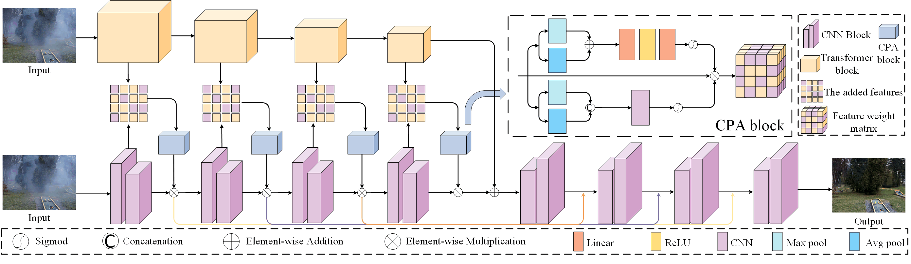

# Interaction-Guided-Two-Branch-Image-Dehazing-Network
 <b>Huichun Liu , Xiaosong Li<sup>*</sup>, Tianshu Tan </b>  
 IEEE/CVF Asian Conference on Computer Vision (**ACCV2024**)<br>
 Paper will be available on arXiv
<hr />


## Network Architecture


## Datasets
<table>
<thead>
  <tr>
    <th>Dataset</th>
    <th>NH-HAZE</th>
    <th>Dense-HAZE</th>
    <th>6k</th>

  </tr>
</thead>
<tbody>
  <tr>
    <td>Baidu Cloud</td>
    <td> <a href="https://pan.baidu.com/share/init?surl=RGaVJ5kbd-cokE8ZAF_THw&pwd=801y">Download (801y)</a> </td>
    <td> <a href="https://pan.baidu.com/share/init?surl=2sQIJQpBYq6EApLGKMurlg&pwd=ixen">Download (ixen)</a> </td>
    <td> <a href="https://pan.baidu.com/s/1WVdNccqDMnJ5k5Q__Y2dsg?pwd=gtuw">Download (gtuw)</a> </td>
  </tr>
</tbody>
</table>

## data
Please download the corresponding  datasets and put them in the folder `./data/<datase_name>`.  (The train and valid split files are provided in `./data/<datase_name>`. )

The `data` directory structure will be arranged as: (**Note**: please check it carefully)   
```
data
   |-Dense-Haze
      |- train_dense
         |- haze
            |- 01_hazy.png 
            |- 02_hazy.png
         |- clear_images
            |- 01_GT.png 
            |- 02_GT.png
         |- trainlist.txt
      |- valid_dense
         |- input 
            |- 51_hazy.png 
            |- 52_hazy.png
         |- gt
            |- 51_GT.png 
            |- 52_GT.png
         |- val_list.txt
   |-NH-Haze
      |- train_NH
         |- haze
            |- 01_hazy.png 
            |- 02_hazy.png
         |- clear_images
            |- 01_GT.png 
            |- 02_GT.png
         |- trainlist.txt
      |- valid_NH
         |- input 
            |- 51_hazy.png 
            |- 52_hazy.png
         |- gt
            |- 51_GT.png 
            |- 52_GT.png
         |- val_list.txt
```
## Pre-trained Models
<table>
<thead>
  <tr>
    <th>Dataset</th>
    <th>NH-HAZE</th>
    <th>Dense-HAZE</th>
    <th>6k</th>
  </tr>
</thead>
<tbody>
  <tr>
    <td>Baidu Cloud</td>
    <td> <a href="https://pan.baidu.com/s/1IMC8H8t-J64Nk8HPdGqoOg?pwd=yzcs">Download (yzcs)</a> </td>
    <td> <a href="https://pan.baidu.com/s/1-Jg-q35fdIRIch2MW4fb0w?pwd=2fzx">Download (2fzx)</a> </td>
    <td> <a href="https://pan.baidu.com/s/14zAE7m4-Otee3KaqR3Q_SQ?pwd=xtds">Download (xtds)</a> </td>
  </tr>
</tbody>
</table>

Then,  place the models to `ckpts/<dataset_name>` directory, separately.

The directory structure will be arranged as:
```
ckpts
   |- Dense
      |- DENSE-16.42ssim0.5235.pt  
   |- NH
      |- NH-20.10ssim6716.pt.pt
   |- 6k
      |- 6K-30.20ssim0.9643.pt

```

## Training
See ` python src/train.py --h` for list of optional arguments, or `train.sh` for examples.

An example of NH-HAZE dataset.
```
CUDA_VISIBLE_DEVICES=0,1 python src/train.py \
  --dataset-name NH \
  --train-dir ./data/train_NH/ \
  --valid-dir ./data/valid_NH/ \
  --ckpt-save-path ../ckpts \
  --ckpt-overwrite \
  --nb-epochs 5000 \
  --batch-size 2\
  --train-size 800 1200  \
  --valid-size 800 1200 \
  --loss l1 \
  --plot-stats \
  --cuda   
```
Or you can just run it
```
bash train.sh
```
## Testing
See `python test_PSNR.py --h` for list of optional arguments, or `test.sh` for an example.

An example of NH-HAZE dataset.
```
CUDA_VISIBLE_DEVICES=1 python src/test_PSNR.py \
  --dataset-name NH   
```
Or you can just run it
```
bash test.sh
```
## Full-size Evaluation Results
<table>
  <tr>
    <th align="left">Dataset</th>
    <th align="center">PSNR</th>
    <th align="center">SSIM</th>
    <th align="center">Entriopy</th>
    <th align="center">LPIPS</th>
  </tr>
  <tr>
    <td align="left">NH-HAZE</td>
    <td align="center">20.10</td>
    <td align="center">0.6716</td>
    <td align="center">7.5319</td>
    <td align="center">0.3210</td>
  </tr>
  <tr>
    <td align="left">Dense-HAZE</td>
    <td align="center">16.42</td>
    <td align="center">0.5235</td>
    <td align="center">6.9600</td>
    <td align="center">0.6696</td>
  </tr>
   <tr>
    <td align="left">6K</td>
    <td align="center">30.20</td>
    <td align="center">0.9643</td>
    <td align="center">7.4325</td>
    <td align="center">0.1749</td>
  </tr>
</table>


## Contact
If you have any question, please feel free to contact us via `Feecuin@outlook.com`.

## Acknowledgments

This code is based on [Dehamer](https://github.com/Li-Chongyi/Dehamer/blob/main), [DeHazeFormer](https://github.com/IDKiro/DehazeFormer).
